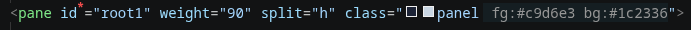
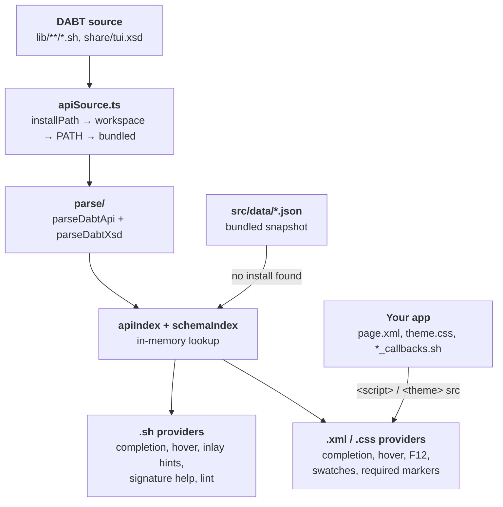

# DABT Tools documentation

DABT Tools is a VS Code extension for writing apps and plugins on [D.A.B.T](https://github.com/DinosaursAreCute/DinosAmazingBashTui) (DinosAmazingBashTui), the pure-bash TUI framework.
It reads DABT's own conventions and turns them into editor features. Doc-comment signatures become inlay hints, `tui.xsd` becomes markup completion, `theme.css` becomes color swatches, and `action="..."` becomes go-to-definition into your `*_callbacks.sh`.

You don't need DABT installed for it to work. If an install is found, it reads that live.

## Where to look

| I want to... | Read |
|---|---|
| **New here?** Install the extension | [guide/install.md](guide/install.md) |
| Know where function signatures and markup data come from, and keep them current | [guide/data-source.md](guide/data-source.md) |
| Get completion, hover, signature help and parameter hints in `.sh` files | [guide/shell-scripts.md](guide/shell-scripts.md) |
| Understand the warnings in the Problems panel | [guide/linting.md](guide/linting.md), [reference/lint-rules.md](reference/lint-rules.md) |
| Write XML pages: completion, hover, F12, scaffolding a page | [guide/xml-markup.md](guide/xml-markup.md) |
| See theme colors on `class="..."` and `br_*` names | [guide/themes-and-colors.md](guide/themes-and-colors.md) |
| Find out why a script is slow: forks, profiling, `bash -x` | [guide/subshells-and-profiling.md](guide/subshells-and-profiling.md) |
| Run `dabt build`, `scan`, `app run`... from the editor | [guide/cli.md](guide/cli.md) |
| Look up **every command** and **every setting** | [reference/commands.md](reference/commands.md), [reference/settings.md](reference/settings.md) |
| Build, package or hack on the extension itself | [development/building.md](development/building.md), [development/architecture.md](development/architecture.md) |
| See what changed | [CHANGELOG.md](https://github.com/DinosaursAreCute/DinosAmazingDabtPlugin/blob/master/CHANGELOG.md) |

New to DABT itself? Start with the framework's [first-app tutorial](https://dinosaursarecute.github.io/DinosAmazingBashTui/tutorials/writing-your-first-app). This site only covers the editor side.

## What it does

That screenshot is from a real editor: a red `*` on `id` (required), a color swatch on `class="panel"`, and `fg`/`bg` inlay hints read from `theme.css`.

| Feature | In short |
|---|---|
| **Lint** | Calls into private internals (`_tui.*`, `_exec_*`, `_tr_*`) from app code, `_TUI_TICK_FN` clobbering, `TUI_MOUSE_DRAIN_PEEK_TIMEOUT=0`, and common bash mistakes (useless `cat`, backticks, `echo -e`, `cmd \| while read`). |
| **Autocomplete & hover** | Every `tui.*` / `_tui.*` function, with its signature, doc text and `file:line`. |
| **Inlay hints & signature help** | Parameter names shown inline at each positional argument: `tui.paint ID:status TEXT:"saved"`. |
| **Abbreviation glossary** | Hover an internal name like `_DLG_KIND` to see what `DLG` and `KIND` stand for. |
| **XML markup tooling** | Tag, attribute and value completion from `tui.xsd`, hover docs, and F12 from `action=`, `on_visit=`, `src=` and `page=` to the real function or file. |
| **Required-attribute markers** | A red `*` on every required attribute you've written. |
| **Page scaffolding** | `DABT: New Page...` writes `NAME.xml` + `NAME_callbacks.sh`. `DABT: Insert Element...` inserts any element as a snippet you can Tab through. |
| **Theme-aware `class=`** | Completion from the page's own `theme.css`, color swatches (fg + bg), and `fg`/`bg`/`mod` inlay hints. `br_*` color names get swatches in `theme.css` too. |
| **Fork counter** | A status-bar count of forks (command substitutions, subshells, pipes...) in the current file, and a per-line and per-workspace report. |
| **CLI integration** | `dabt build`, `scan`, `app run`, `doctor`, `clear-cache` or any other `dabt` command, run in the integrated terminal. |
| **Debugging & profiling** | `bash -x` with a `file:line` prompt, and a real fork count and wall time for a script (Linux). |

## How it fits together

The same parser runs in two places. At runtime it live-scans a DABT checkout. `npm run gen-data` uses it to regenerate the bundled snapshot. So neither source is maintained by hand, and they can't drift apart. See [guide/data-source.md](guide/data-source.md).

## Design rules

- **Read DABT's own conventions, don't re-state them.** Signatures come from doc comments, markup from `tui.xsd`, colors from `theme.css`, callbacks from `<script src>`. When DABT changes, the extension follows.
- **Works with no install.** A snapshot of the API and schema is bundled. A live install replaces it the moment one is found.
- **Never pretend.** Parameter names inferred from a function body are marked as inferred. The fork count is labeled a heuristic. The profiler uses real `/proc/loadavg` measurements.
- **No runtime dependencies.** The extension is a single esbuild bundle.
